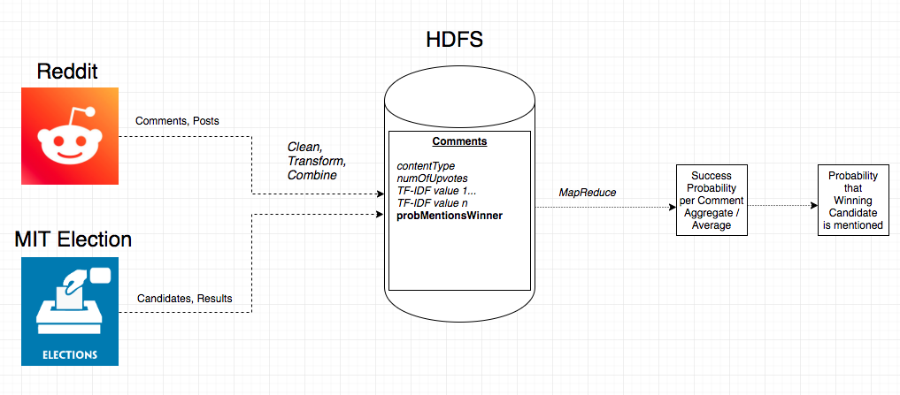
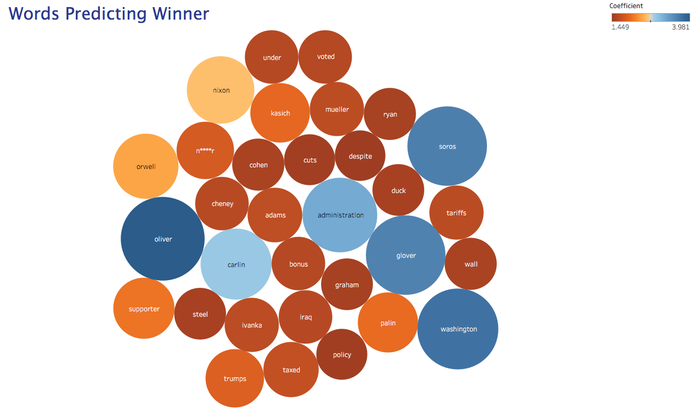
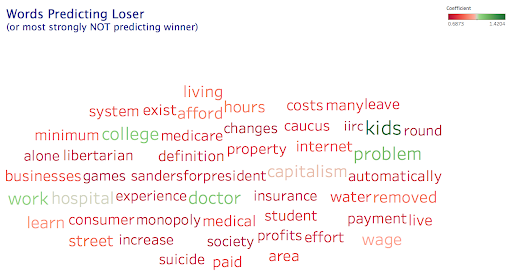

# POLooza
Team project for Real-Time Big Data Analytics Course at NYU, Summer19. (Note that this is a fork from our organization's repository- I forked it to clean it up a bit). 

We hypothesized that Reddit comments in politically-themed communities may provide useful information for predicting the winner of a presidential election. We queried 85 MBs of Reddit comments from the top 50 politically-themed subreddits and mapped these comments to whether or not they contained the winner of the 2016 presidential election (so, a comment gets mapped to "1" if it contains "Trump", and "0" if it does not). We performed text processing (TF-IDF) and logistic regression in MapReduce in order to derive the predictive power that the words in the comments had over the election, i.e. which words were especially predictive of the winner, and which words were especially not. 

Essentially, what we came up with is a rather primitive, but extremely intuitive and useful, form of topic mining. We were able to come up with very interesting results using rather simple text processing methods and predictive algorithms. This solution is also highly scalable to more data- we can handle a much higher volume of data and still expect reasonable performance thanks to our MapReduce back-end for processing. 

# Results
Here are some visualizations of our results. 

